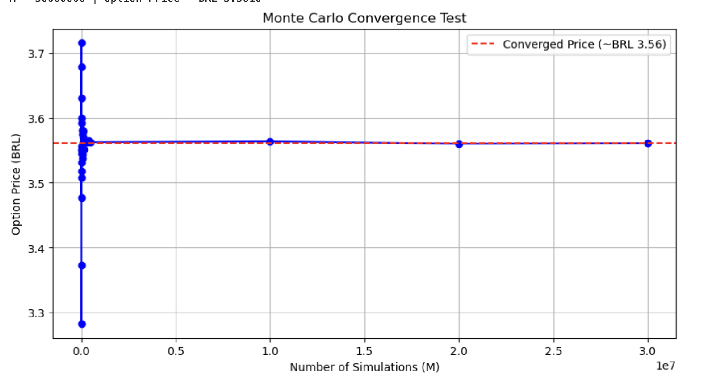

# Monte_Carlo_Basket_Options_Pricing
This project implements an algorithm for pricing multi-asset basket options using Monte Carlo simulation and Cholesky decomposition. For this study, the simulation focuses on a basket consisting of PETR4 and VALE3 equities.

This project implements a Quantitative Finance pricer for **Basket Options** (specifically on Brazilian equities like `PETR4.SA` and `VALE3.SA`) using **Monte Carlo Simulation** and **Cholesky Decomposition** to handle asset correlation. 

Unlike pricing vanilla calls and puts, which have a well-established analytical solution provided by the Black-Scholes model, this project investigates scenarios where the only feasible approach is implementing a Monte Carlo simulation. To evaluate whether the pricing is mathematically sound, we adopted a convergence test that stabilizes at a steady level for a large number of simulations, as expected by the Strong Law of Large Numbers. 

Note that in this type of financial product, the final payoff no longer depends on a single asset, but on multiple assets. Therefore, the assumption of independence between these assets is not necessarily valid, and correlation must be included in the modeling. For instance, if the stock price of a microchip company rises, it is expected that computer company stocks will follow suit; these shared trends are thus captured and translated through correlation.

For this project, it was adopted the following flowchart:

1. **Parameter Estimation**: Historical daily log-returns are calculated from Yahoo Finance data to estimate the annualized volatility vector ($\sigma$) and the annualized Covariance Matrix ($\Sigma$).
2. **Correlation Handling**: We apply **Cholesky Decomposition** to the covariance matrix to get a lower triangular matrix $L$, such that $\Sigma = LL^T$. This allows us to transform independent random shocks into correlated asset movements.
3. **Asset Price Projection**: Each asset price trajectory is simulated using the Geometric Brownian Motion (GBM) stochastic differential equation:
   
$$S_T = S_0 \exp \left( \left( r - \frac{\sigma^2}{2} \right) T + L \cdot Z \sqrt{T} \right)$$
   
5. **Payoff & Discounting**: The option payoff (e.g., $\max(B_T - K, 0)$ for a Call) is computed for each simulated scenario, averaged out, and discounted back to present value using the risk-free rate ($r$). For our case, with a basket of 2 assets, we will have as final prices $S_T^1$ (`PETR4.SA`) and $S_T^2$ (`VALE3.SA`) and consequently, $B_T = \alpha S_T^1 + \beta S_T^2$. For this simulation, it was adopted $\alpha = 0.8$ and $\beta = 0.2$

The plot showing this convergence is given in the following figure:

Consequently, the fair price would be around BRL 3.56.
